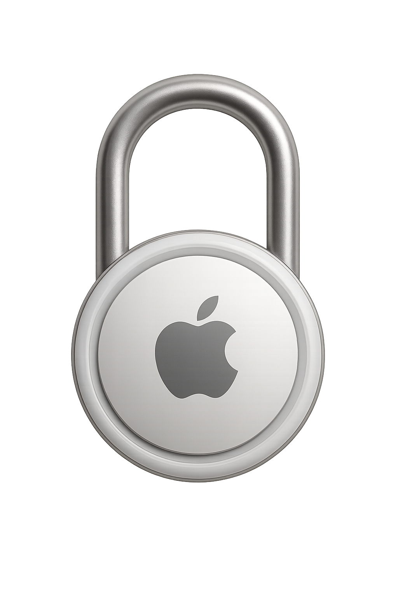

<p align="center">
  
</p>

## ✏️ Overview
LockMyTag is a geofencing solution for Apple AirTags™.  
Key features include:
- **Real-time map:** View your tag's location on a browser-based map.
- **Notifications:** Set up geofencing rules to receive alerts when a tag leaves a defined area during specified times.
- **Historical data:** Access past location data to track your tag's movements over time.

## 🏗️ Architecture
The project consists of the following docker containers:
- `db`: PostgreSQL database that stores all the data related to tags and geofencing rules.
- `nginx`: Serves the frontend and acts as a reverse proxy for the back office.
- `backoffice`: Django application offering an admin interface and REST API.
- `notifier`: A job that checks geofencing rules and sends notifications when conditions are met.

## 🔔 Notifications
For now notifications are basically a Telegram message sent to a bot that you can create and add to a group with the users you want to receive the notifications.

## 📦️ Installation 
- Make sure you have Terraform installed on your machine.
- Set your DigitalOcean API token in terraform/terraform.tfvars (do_token).
- (Optional) Adjust other variables in terraform/terraform.tfvars as needed (image, droplet_name, droplet_region, image_size).
- Open a terminal and navigate to the terraform directory: `cd terraform`
- Initialize Terraform (downloads providers and sets up the project): `terraform init`
- Review the execution plan: `terraform plan`
- Apply the configuration to create the infrastructure: `terraform apply`

## 🛠 Development setup
Spin up all containers:
```bash
make docker/up
```
Now let's create a admin user with username `admin` and password `admin`:
```bash
make docker/create-super-user
```
Then you can access the back office at `http://localhost/admin/` with the previous credentials.  
And the frontend at `http://localhost/` (after being logged in the back office).